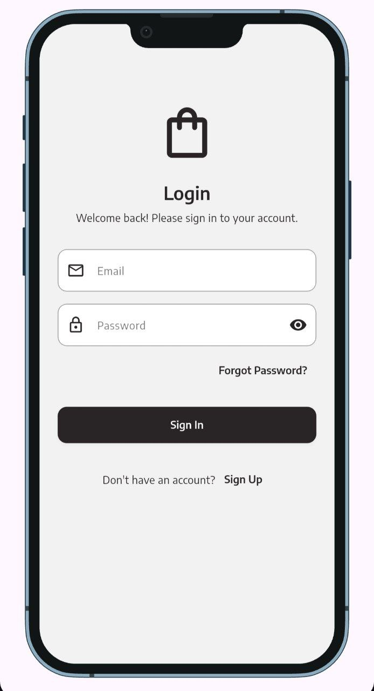
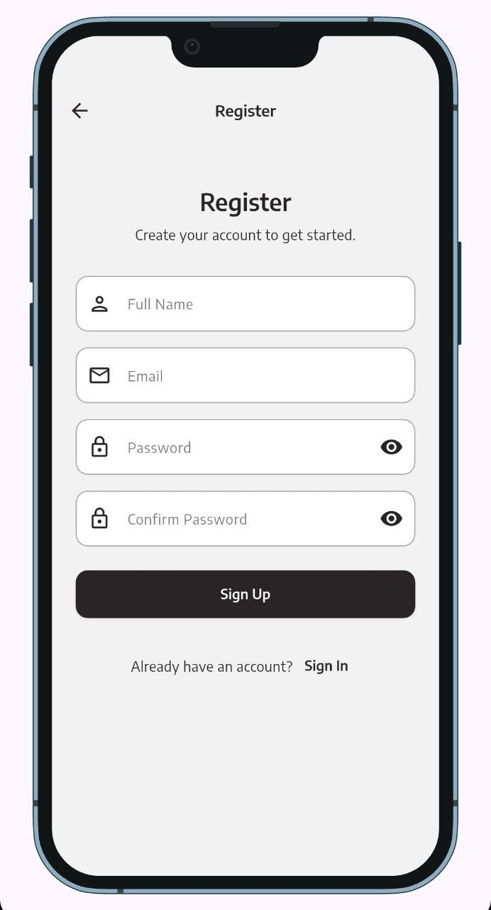
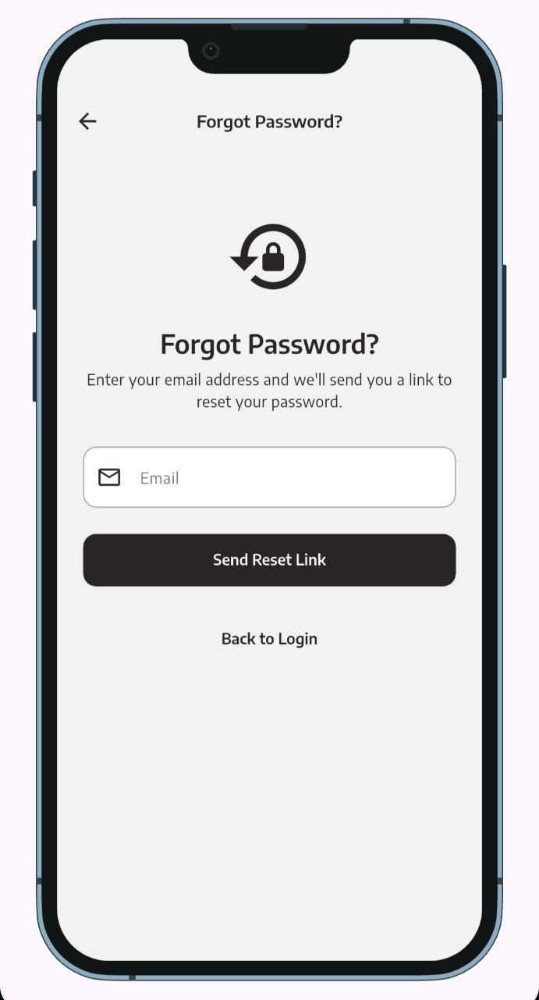
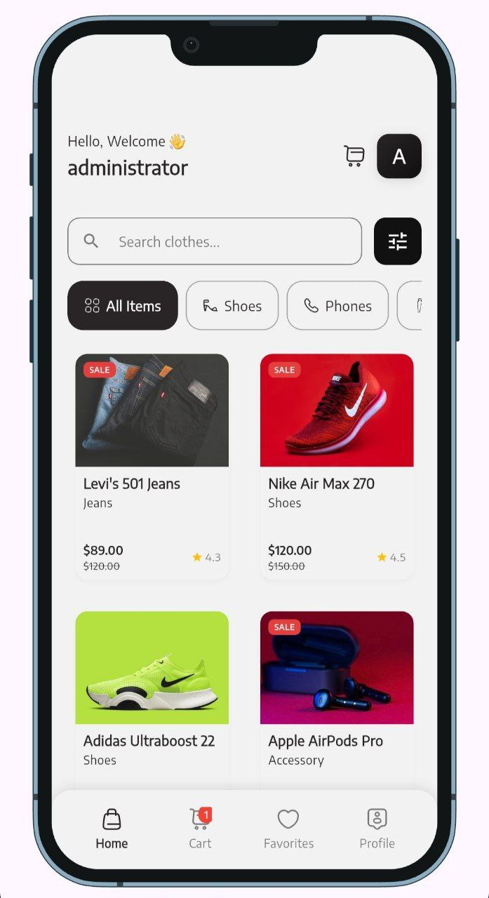
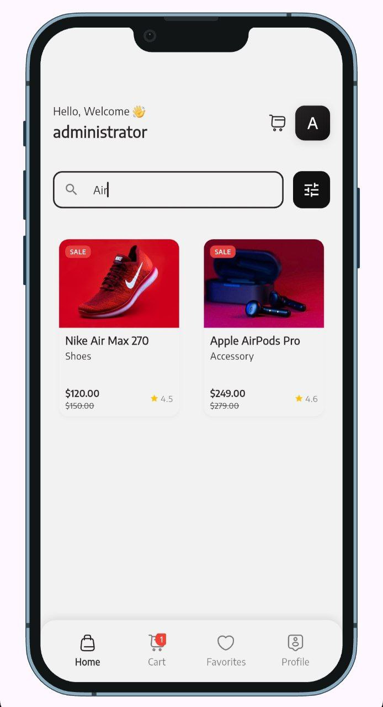
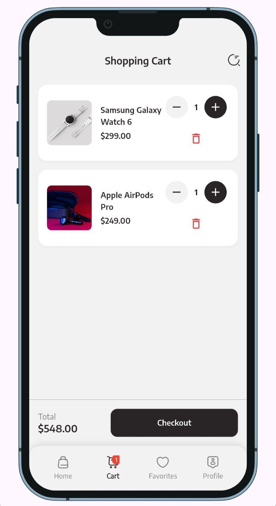
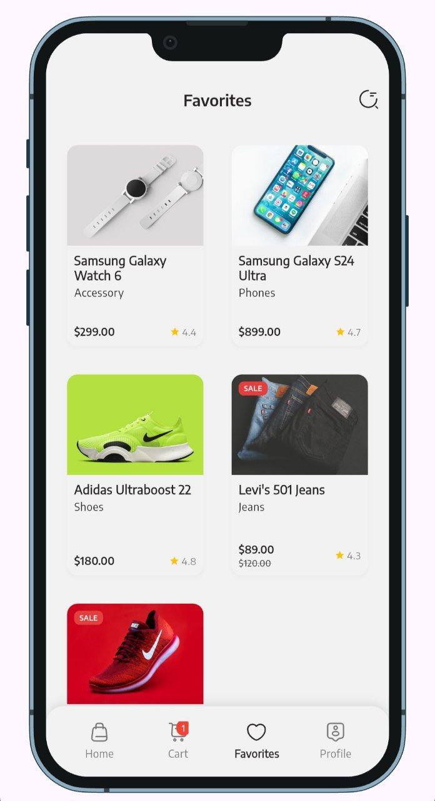
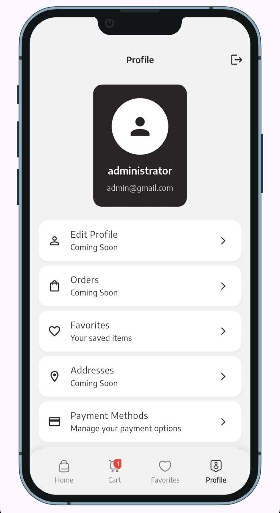
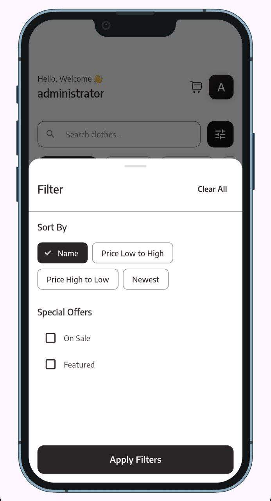
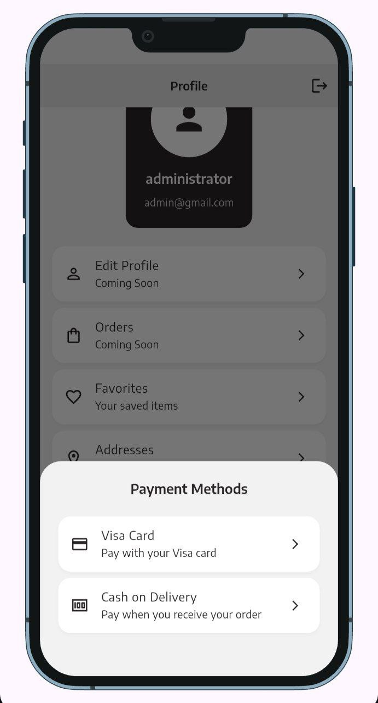

# 🛍️ E-Commerce Mobile App

A modern, AI-powered e-commerce mobile application built with Flutter and Supabase.

## 📱 Screenshots

<div align="center">
<!-- Auth -->
  
  
  


  
  
  
  
  

  
  
  


</div>

## ✨ Features

### 🔐 Authentication
- User Registration & Login
- Password Recovery
- Profile Management

### 🛒 Shopping Experience
- Product Catalog with Categories
- Advanced Search & Filtering
- Product Details with Variants
- Size & Color Selection

### 🛍️ Cart & Favorites
- Shopping Cart Management
- Favorites System
- Persistent Storage with Supabase
- Real-time Updates

### 🎨 Modern UI/UX
- Material Design 3
- Dark/Light Theme Support
- Responsive Layout
- Smooth Animations

## 🏗️ Architecture

Clean Architecture with:
- **Presentation Layer**: UI components and state management
- **Domain Layer**: Business logic and entities
- **Data Layer**: Repositories and data sources

## 🛠️ Tech Stack

- **Flutter 3.x** - Cross-platform framework
- **Supabase** - Backend and database
- **Flutter Bloc** - State management
- **GetIt + Injectable** - Dependency injection
- **GoRouter** - Navigation
- **Clean Architecture** - Scalable code structure

## 🚀 Getting Started

### Prerequisites
- Flutter SDK 3.0+
- Dart SDK 3.0+
- Supabase account

### Installation

1. **Clone the repository**
   ```bash
   git clone https://github.com/yourusername/ecommerce-app.git
   cd ecommerce-app
   ```

2. **Install dependencies**
   ```bash
   flutter pub get
   ```

3. **Configure Supabase**
   - Create a Supabase project
   - Update `lib/core/constants/app_constants.dart`:
   ```dart
   static const String supabaseUrl = 'YOUR_SUPABASE_URL';
   static const String supabaseAnonKey = 'YOUR_SUPABASE_ANON_KEY';
   ```

4. **Set up Database**
   Run the SQL commands in Supabase SQL editor:
   ```sql
   -- Products table
   CREATE TABLE products (
     id UUID DEFAULT gen_random_uuid() PRIMARY KEY,
     name TEXT NOT NULL,
     price DECIMAL(10,2) NOT NULL,
     images TEXT[],
     category TEXT,
     description TEXT,
     rating DECIMAL(2,1) DEFAULT 0.0,
     is_featured BOOLEAN DEFAULT false,
     is_on_sale BOOLEAN DEFAULT false,
     sizes TEXT[],
     colors TEXT[],
     created_at TIMESTAMP WITH TIME ZONE DEFAULT NOW()
   );

   -- Cart items table
   CREATE TABLE cart_items (
     id UUID DEFAULT gen_random_uuid() PRIMARY KEY,
     user_id UUID NOT NULL,
     product_id UUID NOT NULL REFERENCES products(id),
     name TEXT NOT NULL,
     price DECIMAL(10,2) NOT NULL,
     quantity INTEGER DEFAULT 1,
     size TEXT DEFAULT '',
     color TEXT DEFAULT '',
     created_at TIMESTAMP WITH TIME ZONE DEFAULT NOW()
   );

   -- Favorites table
   CREATE TABLE favorites (
     id UUID DEFAULT gen_random_uuid() PRIMARY KEY,
     user_id UUID NOT NULL,
     product_id UUID NOT NULL REFERENCES products(id),
     created_at TIMESTAMP WITH TIME ZONE DEFAULT NOW(),
     UNIQUE(user_id, product_id)
   );

   -- Enable RLS
   ALTER TABLE products ENABLE ROW LEVEL SECURITY;
   ALTER TABLE cart_items ENABLE ROW LEVEL SECURITY;
   ALTER TABLE favorites ENABLE ROW LEVEL SECURITY;

   -- Create policies
   CREATE POLICY "Allow all operations on products" ON products FOR ALL USING (true);
   CREATE POLICY "Allow all operations on cart_items" ON cart_items FOR ALL USING (true);
   CREATE POLICY "Allow all operations on favorites" ON favorites FOR ALL USING (true);
   ```

5. **Generate code**
   ```bash
   dart run build_runner build --delete-conflicting-outputs
   ```

6. **Run the app**
   ```bash
   flutter run
   ```

## 🏗️ Build

### Debug Build
```bash
flutter build apk --debug
```

### Release Build
```bash
flutter build apk --release
```

## 📦 Key Dependencies

- `flutter_bloc` - State management
- `supabase_flutter` - Backend integration
- `go_router` - Navigation
- `get_it` + `injectable` - Dependency injection
- `cached_network_image` - Image caching
- `shared_preferences` - Local storage

## 🎨 Features Overview

### 🏠 Home Screen
- Product grid with categories
- Search functionality
- Filter options
- Featured products

### 🛒 Shopping Cart
- Add/remove items
- Quantity management
- Persistent storage

### ❤️ Favorites
- Save favorite products
- Sync across devices

### 👤 Profile
- User information
- About section
- Payment methods
- Help & support

## 👨‍💻 Author

**Ziya Məhərrəmli**
- Email: maharramovziya7@gmail.com

## 📄 License

This project is licensed under the MIT License.

---

**Made with ❤️ using Flutter and Supabase**